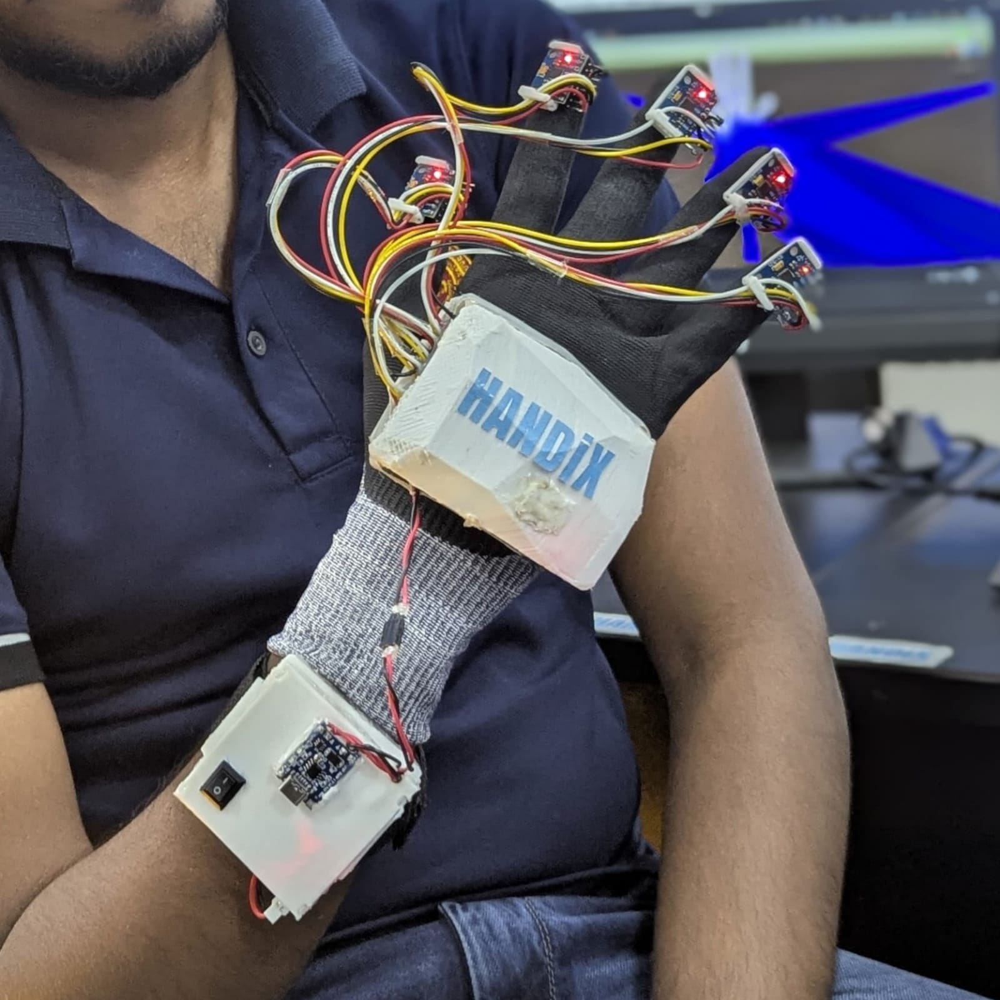

# Hand Tracking Glove

## Overview

This project is a wearable hand tracking glove built with ESP32 microcontrollers, multiple MPU IMU sensors, and an I2C multiplexer for accurate real-time motion capture. It is developed by Noviera Technologies as a foundation for advanced VR/AR interaction, gesture recognition, and future haptic feedback integration.

## Features

- Real-time hand and finger tracking using multiple MPU sensors
- ESP32-based wireless data transmission
- I2C multiplexer and transistor circuits for sensor management
- Modular hardware design for scalability and easy maintenance

## Hardware Components

- ESP32 microcontroller (NodeMCU)
- MPU9250 IMU sensors (one per finger + palm)
- TCA9548A I2C multiplexer
- MOSFET transistors for power control
- Custom PCB and wiring harness
- Battery pack and charging circuit

## Software

- Firmware for ESP32 to collect, process, and transmit sensor data
- Code for sensor calibration and fusion algorithms
- Esp32 file and unity csharp code is include in the repo.

## Future Plans

- Integration with VR/AR platforms for immersive interaction
- Gesture recognition and mapping for virtual control
- Haptic feedback development for enhanced user experience

## License

This project is licensed under the Creative Commons Attribution-NonCommercial 4.0 International License (CC-BY-NC-4.0). See the LICENSE file for details.

## Contact

For questions or collaboration, contact us at ietampawala2002@gmail.com, lukmaantck@gmail.com
